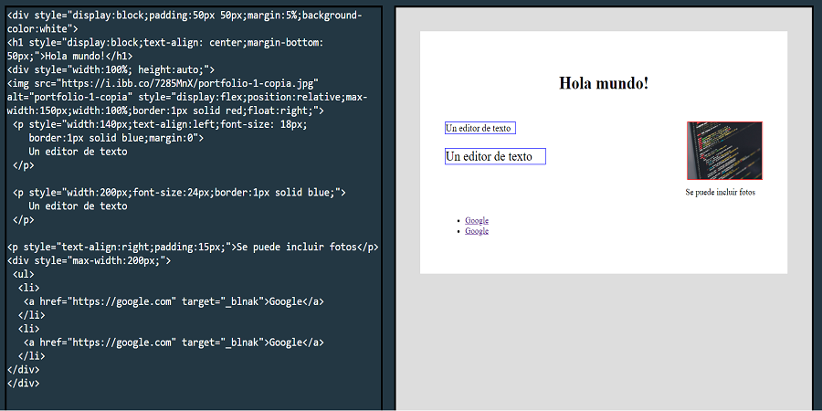
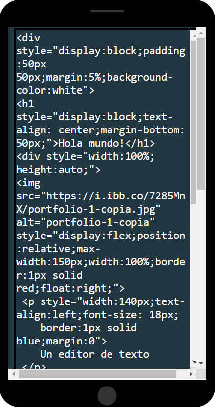
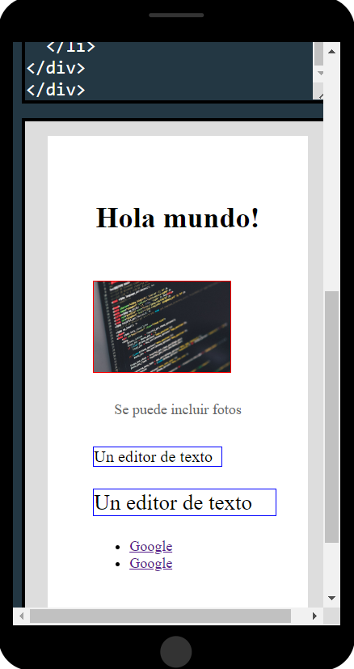

# code-editor
Un sencillo editor de texto para utilizar como playground  en el navegador

## Table of contents

- [Overview](#overview)
  - [Caracteristics](#caracteristics)
  - [Screenshot](#screenshot)
  - [Links](#links)
- [My process](#my-process)
  - [Built with](#built-with)
  - [What I learned](#what-i-learned)
  - [Continued development](#continued-development)
  - [Useful resources](#useful-resources)
- [Author](#author)
- [Acknowledgments](#acknowledgments)


## Overview


Un sencillo editor de texto para utilizar como playground  en el servidor web. Desarrollado con muy poco código. Adaptable a smartphones.

### Caracteristics

You can be able to:

- View the optimal layout for the [code-editor](https://github.com/herby-afro/code-editor) depending on your device's screen size
- See the output at the same time you write the code
- Hide/Show the answer to a question when the question is clicked
- yAvoid switching windows or refreshing the web browser every time you want to see the progress of your project.

### Screenshot






### Links

- Solution URL: [Add solution URL here](https://your-solution-url.com)
- Live Site URL: [herby-afro](https://herbyafro.great-site.net)

## Process

### Built with

- HTML5
- CSS custom properties
- javaScript vainilla
- Mobile-first workflow

### What more?

[code-editor](https://github.com/herby-afro/code-editor) accepts inline styling, linked to style sheets, js code and frameworks...

```html
<h1 style="color:blue;">Inline style</h1>
```

linked to style sheets (Don't forget to add thoese files you need to be vinculade)
```html
<link rel="stylesheet" href="style.css">
```
/style.css
```css
h1 {
  color: blue;
}
```
```js
const actualizar = () => {
  const texto_ingresado = document.getElementById("texto_ingresado");
  const editor = document.getElementById("editor");
  editor.srcdoc = texto_ingresado.value;
}
```

Also you can use the hml theme to have more options like JS files
```html
<!DOCTYPE html>
<html lang="en">

<head>
  <meta charset="UTF-8">
  <meta http-equiv="X-UA-Compatible" content="IE=edge">
  <meta name="viewport" content="width=device-width, initial-scale=1.0">
  <title>Code Editor</title>
  <link rel="stylesheet" href="style.css">
</head>

<body>
  <div class="contenedor">
    <textarea onkeyup="actualizar()" class="texto_ingresado" id="texto_ingresado"
      placeholder="Write your code here"></textarea>
    <iframe class="editor" id="editor" srcdoc="Results here"></iframe>
  </div>
  <script src="./main.js"></script>
</body>

</html>
```


### Continued development

- Add something like Markdown to colorize and indent the code
- Option to save state
- Option to public in live like a blog or web page


## Author

- Website - [Herby](https://herbyafro.great-sie.epizy)
- Twitter - [@Estriplet3](https://www.twitter.com/Estriplet3)

